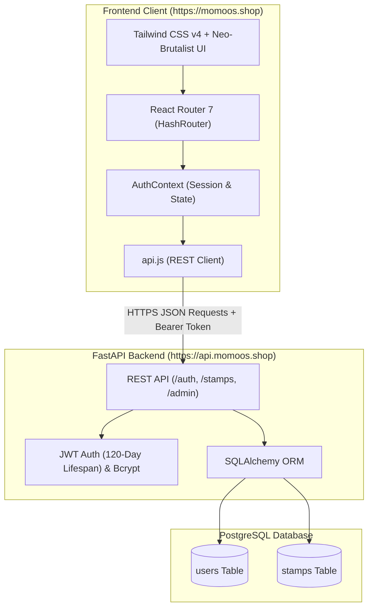

# 🥟 Momoos Truck — Digital Loyalty & Street Food Web App

[](https://vitejs.dev/)
[](https://react.dev/)
[](https://tailwindcss.com/)
[](https://fastapi.tiangolo.com/)
[](https://www.postgresql.org/)
[](LICENSE)
[](https://momoos.shop)
[](https://api.momoos.shop)

A full-stack, mobile-first web application and digital loyalty stamp card designed for the **Momoos Food Truck** in Jabalpur. Customers order hot momos at the truck counter, collect digital stamps on their smartphones, and earn a **100% free plate** after collecting 5 stamps. Truck chefs manage and approve stamp claims in real time via a dedicated Chef Admin console.

Built with a tactile, neo-brutalist street food aesthetic, role-based access control (RBAC), Python FastAPI REST API with PostgreSQL, and automated deployment to GitHub Pages using HashRouter.

---

## 📑 Table of Contents

- [✨ Core Features](#-core-features)
  - [For Customers](#for-customers)
  - [For Truck Chefs / Administrators](#for-truck-chefs--administrators)
  - [Design & UX](#design--ux)
- [🏗️ System Architecture](#️-system-architecture)
  - [Architecture Diagram](#architecture-diagram)
- [🗄️ PostgreSQL Database Schema](#️-postgresql-database-schema)
  - [1. `users` Table](#1-users-table)
  - [2. `stamps` Table](#2-stamps-table)
  - [3. PostgreSQL Initialization Script (`schema.sql`)](#3-postgresql-initialization-script-schemasql)
- [🔐 Authentication & Authorization](#-authentication--authorization)
  - [1. Email + Password Authentication & JWT](#1-email--password-authentication--jwt)
  - [2. Role-Based Route Guards (`ProtectedRoute`)](#2-role-based-route-guards-protectedroute)
  - [3. Promoting a User to Admin](#3-promoting-a-user-to-admin)
- [⚡ Real-Time & Auto-Sync Engine](#-real-time--auto-sync-engine)
- [📁 Project Structure](#-project-structure)
- [🚀 Setup & Deployment](#-setup--deployment)
  - [Frontend Setup (React + Vite)](#frontend-setup-react--vite)
  - [Backend Setup (FastAPI + PostgreSQL)](#backend-setup-fastapi--postgresql)
  - [GitHub Pages Deployment](#github-pages-deployment)
- [📍 Food Truck Coordinates](#-food-truck-coordinates)
- [📄 License](#-license)

---

## ✨ Core Features

### For Customers
* **Digital 5-Stamp Loyalty Card**: Visual stamp slots for each category (`Steam Veg`, `Afghani`, `Fried`). 1 plate purchased = 1 stamp.
* **One-Tap Stamp Claiming**: Submit a claim right at the food truck counter with category preselection.
* **Free Plate Voucher Modal**: Automatically generates a verifiable digital pass (`MOMO-FREE-STM-PASS`, etc.) when 5 stamps are filled.
* **Official Counter Menu**: Browse dishes with canonical pricing (₹50 / ₹60), authentic dish photography, spice levels, portion sizes, dietary tags, and counter extras/dips.
* **Live Food Truck Spot Location**: Embedded interactive Google Map with 1-click directions to the physical truck location in Jabalpur.
* **Streamlined Authentication**: Fast sign up and login using Email and Password with JWT persistence.

### For Truck Chefs / Administrators
* **Real-Time Chef Verification Console** (`/admin`): Live FIFO queue of incoming stamp claims with customer email, name, category, and timestamps.
* **1-Tap Quick Actions**: Instantly **Approve (+1)** or **Reject** pending stamp requests.
* **Auto-Polling Sync**: 10-second background polling with a live countdown timer and manual refresh button.
* **Audit History Log**: View recently processed stamps with statuses and processing timestamps.

### Design & UX
* **Tactile Neo-Brutalist Aesthetic**: Dark theme (`#0d0e12`, `#12141a`), bold monospace typography, high-contrast amber accents (`#fbbf24`), heavy borders (`border-2 border-zinc-800`), and tactile button offset shadows (`shadow-[3px_3px_0px_0px_...]`).
* **Mobile-First Responsive Layout**: Optimized for smartphone touchscreens with zero text clipping, flexbox truncation shields, and touch-friendly targets.
* **HashRouter Navigation**: Seamless client-side routing on static hosting (GitHub Pages) without server rewrite requirements.

---

## 🏗️ System Architecture

Project Momos is architected as a decoupled Single Page Application (SPA) communicating over HTTPS with a Python FastAPI + PostgreSQL backend.

### Architecture Diagram



---

## 🗄️ PostgreSQL Database Schema

The backend uses PostgreSQL with two core relational tables:

### 1. `users` Table

| Column | Type | Constraints | Description |
|---|---|---|---|
| `id` | `SERIAL` | `PRIMARY KEY` | Unique numeric identifier |
| `email` | `VARCHAR(255)` | `UNIQUE NOT NULL` | Customer / Admin email address |
| `password_hash` | `VARCHAR(255)` | `NOT NULL` | Bcrypt password hash |
| `name` | `VARCHAR(255)` | `DEFAULT ''` | Customer name |
| `role` | `VARCHAR(50)` | `DEFAULT 'user'` | Role: `'user'` (customer) or `'admin'` (chef) |
| `created_at` | `TIMESTAMPTZ` | `DEFAULT CURRENT_TIMESTAMP` | Account creation timestamp |

### 2. `stamps` Table (Approved Stamps)

Pending claims stay in Python memory for 2 minutes and are only inserted into PostgreSQL upon chef approval.

| Column | Type | Constraints | Description |
|---|---|---|---|
| `id` | `SERIAL` | `PRIMARY KEY` | Unique stamp identifier |
| `user_id` | `INTEGER` | `REFERENCES users(id) ON DELETE CASCADE` | Foreign key referencing `users.id` |
| `category` | `VARCHAR(100)` | `NOT NULL` | One of: `'Steam Veg'`, `'Afghani'`, `'Fried'` |
| `created_at` | `TIMESTAMPTZ` | `DEFAULT CURRENT_TIMESTAMP` | Timestamp when stamp was approved |

---

### 3. PostgreSQL Initialization Script (`schema.sql`)

You can run this script directly in your PostgreSQL terminal (`psql`) or pgAdmin Query Tool:

```sql
-- Create database (if setting up fresh)
CREATE DATABASE momo_db;
\c momo_db

-- 1. Create Users Table
CREATE TABLE IF NOT EXISTS users (
    id SERIAL PRIMARY KEY,
    email VARCHAR(255) UNIQUE NOT NULL,
    password_hash VARCHAR(255) NOT NULL,
    name VARCHAR(255) DEFAULT '',
    role VARCHAR(50) DEFAULT 'user',
    created_at TIMESTAMP WITH TIME ZONE DEFAULT CURRENT_TIMESTAMP
);

-- 2. Create Stamps Table (Only approved stamps are stored)
CREATE TABLE IF NOT EXISTS stamps (
    id SERIAL PRIMARY KEY,
    user_id INTEGER NOT NULL REFERENCES users(id) ON DELETE CASCADE,
    category VARCHAR(100) NOT NULL,
    created_at TIMESTAMP WITH TIME ZONE DEFAULT CURRENT_TIMESTAMP
);

-- 3. Create Performance Indexes
CREATE INDEX IF NOT EXISTS idx_stamps_user_id ON stamps(user_id);
CREATE INDEX IF NOT EXISTS idx_users_email ON users(email);

-- 4. Seed Pre-configured Admin & Customer Users
-- admin@momo.com    -> password: admin123
-- customer@momo.com -> password: customer123
INSERT INTO users (email, password_hash, name, role)
VALUES 
    ('admin@momo.com', '$2b$12$s06yKFwauKC8QDB0uqlWu.ZwGrdYP2nDsqNC9eesY7NyBWKnMlbXu', 'Chef Admin', 'admin'),
    ('customer@momo.com', '$2b$12$pfpIpqiCbtctpEoGQrYYFOBIvArZq3ZTQvbspucx25qhDj8VU47e6', 'Rahul Sharma', 'user')
ON CONFLICT (email) DO NOTHING;
```

> [!NOTE]
> The FastAPI backend also verifies and automatically initializes the database tables and default accounts on startup if the database exists!

---

## 🔐 Authentication & Authorization

Authentication is centralized in [`src/context/AuthContext.jsx`](file:///d:/Node_X/Project%20Momos/src/context/AuthContext.jsx) and [`src/api.js`](file:///d:/Node_X/Project%20Momos/src/api.js).

### 1. Email + Password Authentication & JWT
* Sign-up via `POST /auth/register` and login via `POST /auth/login`.
* Authenticated requests include the JWT bearer token in headers (`Authorization: Bearer <token>`).
* JWT tokens are issued with a **120-day expiration period** so customer and chef sessions remain active across visits without frequent re-login prompts.
* Tokens are stored in client local storage and decoded on session restore.

### 2. Role-Based Route Guards (`ProtectedRoute`)
Protected routes in [`src/components/ProtectedRoute.jsx`](file:///d:/Node_X/Project%20Momos/src/components/ProtectedRoute.jsx) enforce two tiers of access:
1. **User Tier** (`/user`): Requires an authenticated user session. Redirects visitors to `/auth`.
2. **Admin Tier** (`/admin`): Requires `user.role === 'admin'`. Non-admin accounts receive a formatted **403 Chef Admin Required** screen.

### 3. Promoting a User to Admin
To give an account chef access in PostgreSQL:
```sql
UPDATE users SET role = 'admin' WHERE email = 'chef@momo.com';
```

---

## ⚡ Real-Time & Auto-Sync Engine

* **Live Polling**: The chef admin console checks for incoming claims every 10 seconds via `GET /api/admin/stamps/pending`.
* **Visual Sync Counter**: An animated live indicator and 10-second countdown informs staff when the queue was last refreshed.
* **Instant Action Response**: Approving or rejecting a stamp triggers an immediate optimistic update and refetches the latest queue.

---

## 📁 Project Structure

```text
Project Momos/
├── .github/
│   └── workflows/
│       └── deploy.yml            # Automated GitHub Pages CI/CD workflow
├── backend/                      # Python FastAPI + PostgreSQL backend
│   ├── .env                      # Production / local backend environment variables
│   ├── .env.example              # Template configuration
│   ├── auth.py                   # Bcrypt hashing & JWT verification logic
│   ├── database.py               # SQLAlchemy database session & connection engine
│   ├── main.py                   # FastAPI REST API routes and CORS configuration
│   ├── models.py                 # SQLAlchemy models (User, Stamp)
│   ├── README.md                 # Backend setup guide
│   ├── requirements.txt          # Python pip dependencies
│   ├── schema.sql                # Standalone PostgreSQL SQL initialization script
│   └── schemas.py                # Pydantic request / response schemas
├── public/
│   ├── CNAME                     # Custom domain binding (momoos.shop)
│   ├── favicon.svg               # Momos dumpling browser icon
│   └── preview.png               # OpenGraph preview banner
├── src/
│   ├── assets/                   # Static media and logos
│   ├── components/
│   │   ├── ConfigBanner.jsx      # Configuration alert banner
│   │   ├── Navbar.jsx            # Responsive navigation header
│   │   ├── ProtectedRoute.jsx    # Authentication & admin role route wrapper
│   │   └── TruckLocationMap.jsx  # Google Maps embed with truck coordinates
│   ├── context/
│   │   └── AuthContext.jsx       # Global authentication provider
│   ├── pages/
│   │   ├── AdminDashboard.jsx    # Chef verification console & processing log
│   │   ├── Auth.jsx              # Customer login and sign up
│   │   ├── Home.jsx              # Hero landing page, stamp card mockup, menu intro
│   │   ├── Menu.jsx              # Official truck menu, photography, spice meters
│   │   └── UserDashboard.jsx     # Digital stamp card, claim interface, free voucher
│   ├── api.js                    # FastAPI client API wrapper & session storage
│   ├── App.css                   # Global styling
│   ├── App.jsx                   # Route declarations with HashRouter
│   ├── index.css                 # Tailwind CSS v4 styling rules
│   └── main.jsx                  # React application entry point
├── .gitignore                    # Git ignored files
├── index.html                    # Root HTML template
├── package.json                  # Frontend dependencies and npm scripts
├── vite.config.js                # Vite build configuration (base: './')
└── README.md                     # Project documentation
```

---

## 🚀 Setup & Deployment

### Frontend Setup (React + Vite)

The frontend is hosted at **`https://momoos.shop`** and preconfigured to communicate directly with **`https://api.momoos.shop/api`**.

1. **Install dependencies**:
   ```bash
   npm install
   ```

2. **Build for production**:
   ```bash
   npm run build
   ```

3. **Deploy to GitHub Pages**:
   ```bash
   npm run deploy
   ```

---

### Backend Setup (FastAPI + PostgreSQL)

The backend is hosted at **`https://api.momoos.shop`**.

1. **Install Python dependencies**:
   ```bash
   cd backend
   pip install -r requirements.txt
   ```

2. **Configure `.env`**:
   ```env
   DATABASE_URL=postgresql://<user>:<password>@<host>:5432/momo_db
   SECRET_KEY=your_jwt_secret_key_here
   CORS_ORIGINS=https://momoos.shop,https://www.momoos.shop
   ```

3. **Initialize Database**:
   Run `backend/schema.sql` in your PostgreSQL terminal or let FastAPI auto-create tables on launch.

4. **Run the server**:
   ```bash
   uvicorn main:app --host 0.0.0.0 --port 8000
   ```
   Interactive OpenAPI documentation is accessible at `https://api.momoos.shop/docs`.

---

### GitHub Pages Deployment

The repository includes an automated GitHub Actions deployment workflow in [`.github/workflows/deploy.yml`](file:///d:/Node_X/Project%20Momos/.github/workflows/deploy.yml) that automatically builds and deploys to the `gh-pages` branch upon pushing to `main`.

---

## 📍 Food Truck Coordinates

* **Location**: Jabalpur, Madhya Pradesh, India
* **Latitude**: `23.183469`
* **Longitude**: `79.975397`
* **Map Route**: [Open in Google Maps](https://www.google.com/maps?q=23.183469,79.975397)

---

## 📄 License

This project is licensed under the MIT License — see the [LICENSE](LICENSE) file for details.
