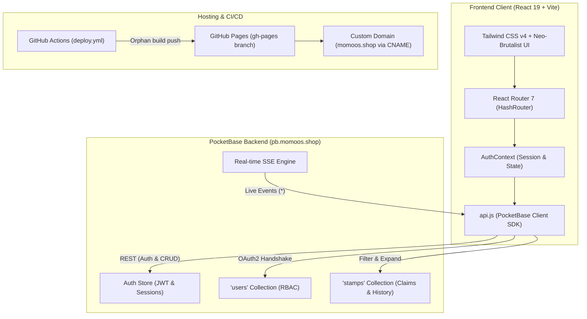
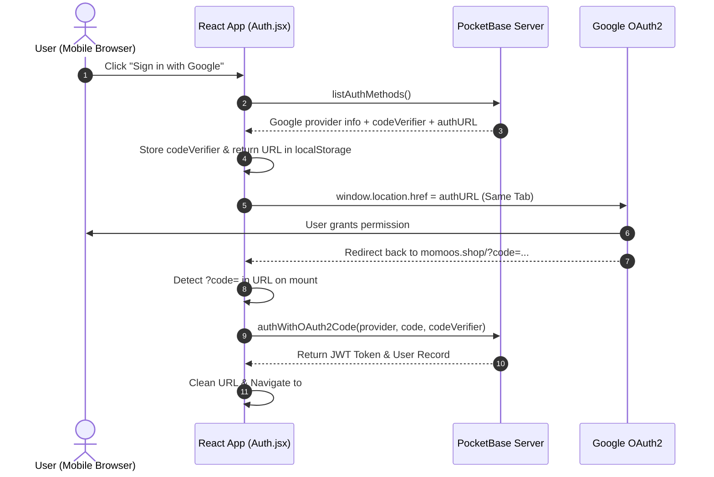

# 🥟 Momoos Truck — Digital Loyalty & Street Food Web App

[](https://vitejs.dev/)
[](https://react.dev/)
[](https://tailwindcss.com/)
[](https://pocketbase.io/)
[](LICENSE)
[](https://momoos.shop)

A full-stack, mobile-first web application and digital stamp card designed for the **Momoos Food Truck** in Jabalpur. Customers order hot momos at the truck counter, collect digital stamps on their smartphones, and earn a **100% free plate** after collecting 5 stamps. Truck chefs manage and approve stamp claims in real time via a dedicated Chef Admin console.

Built with a tactile, neo-brutalist street food aesthetic, real-time Server-Sent Events (SSE), role-based access control, same-window Google OAuth2, and automated CI/CD deployment to GitHub Pages.

---

## 📑 Table of Contents

- [🥟 Momoos Truck — Digital Loyalty \& Street Food Web App](#-momoos-truck--digital-loyalty--street-food-web-app)
  - [📑 Table of Contents](#-table-of-contents)
  - [✨ Core Features](#-core-features)
    - [For Customers](#for-customers)
    - [For Truck Chefs / Administrators](#for-truck-chefs--administrators)
    - [Design \& UX](#design--ux)
  - [🏗️ System Architecture](#️-system-architecture)
    - [Architecture Diagram](#architecture-diagram)
  - [🗄️ Data Modeling \& Database Schema](#️-data-modeling--database-schema)
    - [1. `users` Collection (System Auth)](#1-users-collection-system-auth)
    - [2. `stamps` Collection (Application Data)](#2-stamps-collection-application-data)
    - [3. PocketBase API Rules (Access Control)](#3-pocketbase-api-rules-access-control)
  - [🔐 Authentication \& Authorization](#-authentication--authorization)
    - [1. Email + Password Authentication](#1-email--password-authentication)
    - [2. Same-Window Google OAuth2 Redirect Flow](#2-same-window-google-oauth2-redirect-flow)
    - [3. Role-Based Route Guards (`ProtectedRoute`)](#3-role-based-route-guards-protectedroute)
  - [⚡ Real-Time Stamp Synchronization](#-real-time-stamp-synchronization)
  - [📁 Project Structure](#-project-structure)
  - [🚀 Getting Started](#-getting-started)
    - [Prerequisites](#prerequisites)
    - [Installation](#installation)
    - [Environment Configuration](#environment-configuration)
    - [Development Server](#development-server)
    - [Production Build](#production-build)
  - [⚙️ PocketBase Backend Setup](#️-pocketbase-backend-setup)
    - [Step 1: Create the `stamps` Collection](#step-1-create-the-stamps-collection)
    - [Step 2: Add `role` Field to `users`](#step-2-add-role-field-to-users)
    - [Step 3: Promoting a User to Admin / Chef](#step-3-promoting-a-user-to-admin--chef)
    - [Step 4: Enable Google OAuth2 (Optional)](#step-4-enable-google-oauth2-optional)
  - [🚢 CI/CD \& GitHub Pages Deployment](#-cicd--github-pages-deployment)
  - [📍 Food Truck Coordinates](#-food-truck-coordinates)
  - [📄 License](#-license)

---

## ✨ Core Features

### For Customers
* **Digital 5-Stamp Loyalty Card**: Visual stamp slots for each category (`Steam Veg`, `Afghani`, `Fried`). 1 plate purchased = 1 stamp.
* **One-Tap Stamp Claiming**: Submit a claim right at the food truck counter with category preselection.
* **Free Plate Voucher Modal**: Automatically generates a verifiable digital pass (`MOMO-FREE-STM-PASS`, etc.) when 5 stamps are filled.
* **Official Counter Menu**: Browse dishes with canonical pricing (₹50 / ₹60), authentic dish photography, spice levels, portion sizes, dietary tags, and counter extras/dips.
* **Live Food Truck Spot Location**: Embedded interactive Google Map with 1-click directions to the physical truck location in Jabalpur.
* **Dual Authentication**: Sign in via Email/Password or 1-tap Google Sign-In.

### For Truck Chefs / Administrators
* **Real-Time Chef Verification Console** (`/admin`): Live FIFO queue of incoming stamp claims with customer email, name, category, and timestamps.
* **1-Tap Quick Actions**: Instantly **Approve** or **Reject** pending stamp requests.
* **Real-time Synchronization**: Connected via PocketBase Server-Sent Events (SSE) so claims appear instantly without manual page reloads.
* **Fallback Auto-Polling**: 10-second background poll with a visible live countdown timer.
* **Audit History Log**: View the last 30 processed stamps with statuses and processing timestamps.

### Design & UX
* **Tactile Neo-Brutalist Aesthetic**: Dark theme (`#0d0e12`, `#12141a`), bold monospace typography, high-contrast amber accents (`#fbbf24`), heavy borders (`border-2 border-zinc-800`), and tactile button offset shadows (`shadow-[3px_3px_0px_0px_...]`).
* **Mobile-First Responsive Layout**: Optimized for smartphone touchscreens with zero text clipping, flexbox truncation shields, and touch-friendly targets.
* **HashRouter Navigation**: Seamless client-side routing on static hosting (GitHub Pages) without server rewrite requirements.

---

## 🏗️ System Architecture

Project Momos is architected as a decoupled Single Page Application (SPA) powered by a lightweight, high-performance PocketBase backend.

### Architecture Diagram



---

## 🗄️ Data Modeling & Database Schema

The backend uses PocketBase (SQLite-based). The system relies on two primary collections:

### 1. `users` Collection (System Auth)

Extends PocketBase's default `users` authentication collection:

| Field | Type | Required | Description |
|---|---|---|---|
| `id` | `TEXT` (15 chars) | Yes | Unique user identifier generated by PocketBase |
| `email` | `EMAIL` | Yes | Unique customer / admin email address |
| `name` | `TEXT` | No | Display name entered during signup or from Google |
| `role` | `SELECT` | Yes | User authorization role: `'user'` (default) or `'admin'` |
| `created` | `DATETIME` | Auto | Account registration timestamp |
| `updated` | `DATETIME` | Auto | Account update timestamp |

### 2. `stamps` Collection (Application Data)

Stores every stamp request, verification decision, and loyalty transaction:

| Field | Type | Required | Description |
|---|---|---|---|
| `id` | `TEXT` (15 chars) | Yes | Unique stamp record identifier |
| `user` | `RELATION` | Yes | Foreign key reference to `users.id` (cascade on delete) |
| `category` | `SELECT` | Yes | One of: `'Steam Veg'`, `'Afghani'`, `'Fried'` |
| `status` | `SELECT` | Yes | State of claim: `'pending'`, `'approved'`, `'rejected'` |
| `created` | `DATETIME` | Auto | Timestamp when user submitted the claim |
| `updated` | `DATETIME` | Auto | Timestamp when chef approved/rejected the claim |

> [!NOTE]
> **Backward Compatibility**: `api.js` includes an automatic fallback to a collection named `tickets` if `stamps` returns a 404, guaranteeing zero downtime across legacy database migrations.

### 3. PocketBase API Rules (Access Control)

To secure the backend while allowing seamless interaction, the collection rules are configured as:

* **List / Search Rule**:
  ```text
  @request.auth.id != "" && (@request.auth.id = user || @request.auth.role = "admin")
  ```
  *(Customers can only list their own stamps; Admins can list all stamps)*
* **View Rule**:
  ```text
  @request.auth.id != "" && (@request.auth.id = user || @request.auth.role = "admin")
  ```
* **Create Rule**:
  ```text
  @request.auth.id != "" && @request.auth.id = @request.data.user && @request.data.status = "pending"
  ```
  *(Customers can only submit claims for themselves with initial status "pending")*
* **Update Rule**:
  ```text
  @request.auth.role = "admin"
  ```
  *(Only staff with role "admin" can approve or reject stamps)*
* **Delete Rule**:
  ```text
  @request.auth.role = "admin"
  ```

---

## 🔐 Authentication & Authorization

Authentication is centralized in [`src/context/AuthContext.jsx`](file:///d:/Node_X/Project%20Momos/src/context/AuthContext.jsx) and [`src/api.js`](file:///d:/Node_X/Project%20Momos/src/api.js).

### 1. Email + Password Authentication
* Standard sign-up and sign-in against PocketBase `users.authWithPassword()`.
* Automatically signs in the user upon successful registration.
* Validates minimum password length (6 characters) and confirmation match.

### 2. Same-Window Google OAuth2 Redirect Flow
Pop-up based OAuth frequently fails or gets blocked on mobile browsers (Safari on iOS, Chrome on Android). Project Momos implements a bulletproof **same-window redirect flow**:



### 3. Role-Based Route Guards (`ProtectedRoute`)
Protected routes in [`src/components/ProtectedRoute.jsx`](file:///d:/Node_X/Project%20Momos/src/components/ProtectedRoute.jsx) enforce two tiers of access:
1. **User Tier** (`/user`): Requires `user !== null`. Redirects unauthenticated visitors to `/auth`.
2. **Admin Tier** (`/admin`): Requires `user !== null` and `user.role === 'admin'`. Non-admin accounts receive a formatted **403 Chef Admin Required** screen with clear instructions on how to promote the account in PocketBase.

---

## ⚡ Real-Time Stamp Synchronization

To ensure the chef and customer experiences feel instant at the food truck counter:
1. **Server-Sent Events (SSE)**: On `/admin`, `api.subscribeStamps()` subscribes to `pb.collection('stamps').subscribe('*', callback)`. Whenever a customer submits a claim, the chef's dashboard updates immediately.
2. **Auto-Polling Fallback**: A 10-second `setInterval` polls `getAdminPendingStamps()` in the background to handle edge cases like cellular reconnects.
3. **Visual Countdown**: A 10-second decrementing countdown pill displays live sync status for truck staff.

---

## 📁 Project Structure

```text
Project Momos/
├── .github/
│   └── workflows/
│       └── deploy.yml            # CI/CD: Automated build & deploy to gh-pages branch
├── public/
│   ├── CNAME                     # Custom domain binding (momoos.shop)
│   ├── favicon.svg               # Momos dumpling browser icon
│   └── preview.png               # OpenGraph preview banner
├── src/
│   ├── assets/                   # Static media and logos
│   ├── components/
│   │   ├── ConfigBanner.jsx      # Configuration alert banner
│   │   ├── Navbar.jsx            # Responsive navigation header with active pills
│   │   ├── ProtectedRoute.jsx    # Authentication & admin role route wrapper
│   │   └── TruckLocationMap.jsx  # Google Maps embed with truck coordinates
│   ├── context/
│   │   └── AuthContext.jsx       # Global authentication provider & session listener
│   ├── pages/
│   │   ├── AdminDashboard.jsx    # Real-time chef verification console & history
│   │   ├── Auth.jsx              # Customer login, register, and Google OAuth
│   │   ├── Home.jsx              # Hero landing page, stamp card mockup, steps, plates
│   │   ├── Menu.jsx              # Official truck menu, photography, spice meters, sides
│   │   └── UserDashboard.jsx     # Digital stamp card, claim interface, free plate pass
│   ├── api.js                    # PocketBase client SDK wrapper & error helpers
│   ├── App.css                   # Component-level styling overrides
│   ├── App.jsx                   # Route declarations with HashRouter
│   ├── index.css                 # Tailwind CSS v4 styling rules
│   └── main.jsx                  # React application entry point
├── .gitignore                    # Git ignored dependencies and build artifacts
├── .oxlintrc.json                # Oxlint linter configuration
├── index.html                    # Root HTML template with OpenGraph metadata
├── package.json                  # Dependencies and execution scripts
├── vite.config.js                # Vite configuration with relative base ('./')
└── README.md                     # Comprehensive project documentation
```

---

## 🚀 Getting Started

### Prerequisites
* **Node.js**: `v20.x` or higher
* **npm**: `v10.x` or higher
* A running **PocketBase** instance (v0.22+ or v0.28+)

### Installation

1. **Clone the repository**:
   ```bash
   git clone https://github.com/Joshi-labs/Project-Momos.git
   cd Project-Momos
   ```

2. **Install dependencies**:
   ```bash
   npm install
   ```

### Environment Configuration

By default, the application connects to the production PocketBase server (`https://pb.momoos.shop`). To point to a local or custom PocketBase instance, create a `.env.local` file in the project root:

```env
VITE_POCKETBASE_URL=http://127.0.0.1:8090
```

### Development Server

Start Vite's fast development server:
```bash
npm run dev
```
Open your browser at `http://localhost:5173`.

### Production Build

Create an optimized static distribution in `./dist`:
```bash
npm run build
```

Preview the production build locally:
```bash
npm run preview
```

---

## ⚙️ PocketBase Backend Setup

If you are setting up a new PocketBase server from scratch, follow these steps:

### Step 1: Create the `stamps` Collection
In the PocketBase Admin UI (`/_/`):
1. Click **New Collection** → Name: `stamps` (Type: Base collection).
2. Add fields:
   * `user` (Type: Relation → Single → Collection: `users`, Required: Yes, Cascade delete: Yes)
   * `category` (Type: Select → Values: `Steam Veg`, `Afghani`, `Fried`, Required: Yes)
   * `status` (Type: Select → Values: `pending`, `approved`, `rejected`, Required: Yes)
3. Set API Rules as detailed in [Section 3](#3-pocketbase-api-rules-access-control).

### Step 2: Add `role` Field to `users`
1. Go to the `users` collection settings.
2. Add field: `role` (Type: Select → Values: `user`, `admin`, Required: Yes, Default value: `user`).

### Step 3: Promoting a User to Admin / Chef
To give an account access to `/admin`:
1. Open PocketBase Admin UI → `users` collection.
2. Find the user record.
3. Change `role` from `user` to `admin` and save.

### Step 4: Enable Google OAuth2 (Optional)
1. Go to **Settings** → **Auth providers** → **Google**.
2. Enable Google and enter your Google Cloud **Client ID** and **Client Secret**.
3. In Google Cloud Console, add `https://pb.momoos.shop/api/oauth2-redirect` to your Authorized Redirect URIs.

---

## 🚢 CI/CD & GitHub Pages Deployment

The repository includes a fully automated GitHub Actions workflow in [`.github/workflows/deploy.yml`](file:///d:/Node_X/Project%20Momos/.github/workflows/deploy.yml).

### How It Works:
1. Triggers on any `git push` to branch `main` (or via manual trigger `workflow_dispatch`).
2. Checks out code and installs dependencies using `npm ci`.
3. Runs `npm run build` to compile the app into `./dist`.
4. Deploys using `peaceiris/actions-gh-pages@v4` with `force_orphan: true`:
   * Completely **cleans/wipes previous content and history** of the `gh-pages` branch.
   * Pushes only the newly built static files to `gh-pages`.
   * Preserves `CNAME` (`momoos.shop`) automatically.

### Configuring GitHub Repository:
1. Navigate to your repository on GitHub.
2. Go to **Settings** → **Pages**.
3. Under **Build and deployment** > **Source**, choose **Deploy from a branch**.
4. Set the branch to **`gh-pages`** and folder to **`/ (root)`**, then click **Save**.

---

## 📍 Food Truck Coordinates

* **Location**: Jabalpur, Madhya Pradesh, India
* **Latitude**: `23.183469`
* **Longitude**: `79.975397`
* **Map Route**: [Open in Google Maps](https://www.google.com/maps?q=23.183469,79.975397)

---

## 📄 License

This project is licensed under the MIT License — see the [LICENSE](LICENSE) file for details.

